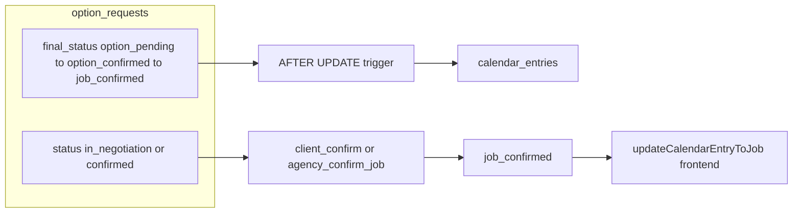

# IndexCasting — Business-Logic System Snapshot (Stand Repo)

Dieses Dokument basiert auf dem **aktuellen** Code im Repository-Root (TypeScript unter `src/`, SQL unter `supabase/migrations/`). **Live-DB** kann bei Root-SQL-Only-Artefakten abweichen — siehe Abschnitte 7 und 9.

---

## 1. Current Request System

### 1.1 Einheitliches Datenmodell

**Eine** Haupttabelle: `public.option_requests`. Es gibt **keine** separate „Casting“-Tabelle im beschriebenen Flow — Unterscheidung über Spalte **`request_type`**: `'option' | 'casting'` (im TS-Typ in [`src/services/optionRequestsSupabase.ts`](../src/services/optionRequestsSupabase.ts) `SupabaseOptionRequest.request_type`).

**Kernfelder (Auszug, tatsächliche Namen):**

| Bereich | Spalten |
|--------|---------|
| Identität / Zuordnung | `id`, `client_id`, `model_id`, `agency_id`, `booker_id`, `organization_id` (Client-Legacy/Org), `agency_organization_id`, `client_organization_id`, `created_by`, `agency_assignee_user_id` |
| Workflow „Chat“-Status | `status`: `'in_negotiation' \| 'confirmed' \| 'rejected'` |
| Verfügbarkeit (Achse 2) | `final_status`: `'option_pending' \| 'option_confirmed' \| 'job_confirmed' \| null`; `model_approval`: `'pending' \| 'approved' \| 'rejected'`; `model_approved_at`; `model_account_linked` (bool/null, Fallback im Produkt **`?? false`**) |
| Preis (Achse 1) | `proposed_price`, `agency_counter_price`, `client_price_status`: `'pending' \| 'accepted' \| 'rejected' \| null`; `currency` |
| Termin | `requested_date`, `start_time`, `end_time` |
| Agency-only | `is_agency_only` (bool); `agency_event_group_id` (Gruppierung manueller Events) |
| Meta | `client_name`, `model_name`, `job_description`, `client_organization_name`, `agency_organization_name`, `created_at`, `updated_at` |

**Zwei SELECT-Kontrakte** (Defense-in-Depth für Model-Sicht):

- [`OPTION_REQUEST_SELECT`](../src/services/optionRequestsSupabase.ts) — **voll** inkl. Preisfelder (Client/Agency).
- [`OPTION_REQUEST_SELECT_MODEL_SAFE`](../src/services/optionRequestsSupabase.ts) — **ohne** `proposed_price`, `agency_counter_price`, `client_price_status`.

### 1.2 Core-Logik — Dateien

| Schicht | Datei | Rolle |
|---------|--------|--------|
| API / DB-Zugriff | [`src/services/optionRequestsSupabase.ts`](../src/services/optionRequestsSupabase.ts) | CRUD, RPCs (`client_confirm_option_job`, `agency_confirm_job_agency_only`, `delete_option_request_full`, …), Nachrichten, Uploads, Booking-Event-Helfer |
| Client-State / Orchestrierung | [`src/store/optionRequests.ts`](../src/store/optionRequests.ts) | Cache, `toLocalRequest`, Store-Aktionen (Availability, Preis, Job, Delete), Inflight-Guards, Notifications |
| Attention / Ableitung | [`src/utils/optionRequestAttention.ts`](../src/utils/optionRequestAttention.ts), [`src/utils/negotiationAttentionLabels.ts`](../src/utils/negotiationAttentionLabels.ts) | Zwei Dimensionen D1/D2, Header-Labels, Tab-Dot |
| Kalender-Projektion | [`src/utils/calendarProjectionLabel.ts`](../src/utils/calendarProjectionLabel.ts), [`src/utils/calendarDetailNextStep.ts`](../src/utils/calendarDetailNextStep.ts), [`src/utils/agencyCalendarUnified.ts`](../src/utils/agencyCalendarUnified.ts) | Badges, Next-Step, Merge mit `booking_events` |
| Preis-„settled“-Hilfe | [`src/utils/priceSettlement.ts`](../src/utils/priceSettlement.ts) | `priceCommerciallySettled` (strenger als reines `client_price_status`) |

### 1.3 `request_type`: option vs casting

- **`option`**: Kann bis **`job_confirmed`** eskalieren (RPC [`client_confirm_option_job`](../supabase/migrations/20260551_client_confirm_option_job_rpc.sql) prüft `request_type = 'option'`).
- **`casting`**: In [`deriveApprovalAttention`](../src/utils/optionRequestAttention.ts) wird bei `final_status === 'option_confirmed'` und `requestType === 'casting'` der Job-Finalisierungszustand als **`fully_cleared`** behandelt (kein „waiting_for_*_finalize_job“ für Casting). Store [`clientConfirmJobStore`](../src/store/optionRequests.ts) blockt Castings explizit.
- Kalender-Titel im Trigger [`fn_ensure_calendar_on_option_confirmed`](../supabase/migrations/20260563_ensure_calendar_on_option_confirmed_trigger.sql): Prefix **„Casting –“** vs **„Option –“**; `entry_type` entsprechend `'casting'` vs `'option'`.

### 1.4 Verfügbarkeit (Achse 2) — Felder und Übergänge

**Semantik:**

- **`final_status = 'option_pending'`**: Agency hat die Verfügbarkeit für diesen Request noch nicht auf „bestätigt“ gesetzt (Ausgangszustand / nach bestimmten Rejects, siehe Trigger).
- **`final_status = 'option_confirmed'`**: Agency hat Verfügbarkeit bestätigt (`agencyAcceptRequest` in [`optionRequestsSupabase.ts`](../src/services/optionRequestsSupabase.ts)): reines UPDATE auf `final_status` (und je nach `model_account_linked` auch `model_approval`).
- **`final_status = 'job_confirmed'`**: Termineller Job — nur durch **`client_confirm_option_job`** (Client-Flow) oder **`agency_confirm_job_agency_only`** (Agency-only), nicht durch einzelne Client-Updates.

**`agencyAcceptRequest` (Availability confirm)** — Logik:

1. Wenn **`model_account_linked === false`** (`?? false`): UPDATE `final_status = 'option_confirmed'`, `model_approval = 'approved'`, `model_approved_at = now`, Guard `.eq('status','in_negotiation')`.
2. Wenn verlinkt und **`model_approval === 'approved'`** schon: UPDATE nur `final_status = 'option_confirmed'` (+ ggf. `model_approved_at`).
3. Wenn verlinkt und **`model_approval === 'pending'`**: UPDATE nur `final_status = 'option_confirmed'` — Model muss danach bestätigen.

**Model bestätigt Verfügbarkeit:** [`modelConfirmOptionRequest`](../src/services/optionRequestsSupabase.ts): nur wenn `model_approval === 'pending'`, `model_account_linked` truthy, **`final_status === 'option_confirmed'`**, dann UPDATE `model_approval = 'approved'`, `model_approved_at`, **`status = 'confirmed'`** (wichtig für `client_confirm_option_job` bei verlinktem Model).

**Model lehnt ab:** [`modelRejectOptionRequest`](../src/services/optionRequestsSupabase.ts): UPDATE **`model_approval = 'rejected'`, `status = 'rejected'`** — **kein** `final_status` im Payload; Reset läuft über DB-Trigger.

**DB-State-Machine (Auszug)** — [`fn_validate_option_status_transition`](../supabase/migrations/20260711_formalize_option_status_transition_trigger.sql):

- `status`: `rejected` terminal; `confirmed` darf nicht zurück zu `in_negotiation`.
- `final_status`: `job_confirmed` terminal; **`option_confirmed` → `option_pending` generell verboten** im Trigger — daher kein explizites `final_status: 'option_pending'` im Client bei Model-Reject.
- `model_approval`: `rejected` terminal; `approved` darf nicht zurück zu `pending`.

**Reset bei Rejection:** [`fn_reset_final_status_on_rejection`](../supabase/migrations/20260555_model_reject_resets_final_status.sql) (BEFORE UPDATE auf `status`): wenn `status → rejected` und vorher nicht rejected und `final_status = 'option_confirmed'`, setzt **`NEW.final_status := 'option_pending'`** (semantische Konsistenz nach Model-Decline).

**Kalender bei Reject:** [`fn_cancel_calendar_on_option_rejected`](../supabase/migrations/20260548_cancel_calendar_on_option_rejected_trigger.sql) (Referenz in Repo) + spätere Erweiterungen für `booking_events` ([`20260821_reject_cancels_booking_events.sql`](../supabase/migrations/20260821_reject_cancels_booking_events.sql)).

### 1.5 Preis (Achse 1)

- **Felder:** `proposed_price`, `agency_counter_price`, `client_price_status`.
- **UI/Attention „commercially settled“:** [`priceCommerciallySettled`](../src/utils/priceSettlement.ts): `client_price_status === 'accepted'` **und** mindestens ein Anker (`agency_counter_price` oder `proposed_price` numerisch).
- **RPC Job-Confirm:** [`client_confirm_option_job`](../supabase/migrations/20260551_client_confirm_option_job_rpc.sql) prüft **`client_price_status = 'accepted'`** (ohne die striktere Anchor-Logik der UI).
- **Gegenangebote / Ablehnung:** Store-Funktionen in [`optionRequests.ts`](../src/store/optionRequests.ts) rufen Services wie `agencyAcceptClientPrice`, `setAgencyCounterOffer`, `clientAcceptCounterPrice`, `clientRejectCounterOfferOnSupabase` (Implementierung in `optionRequestsSupabase.ts`) — Details in Abschnitt 2.
- **Freeze nach Akzeptanz:** Migration [`20260547_option_requests_freeze_prices_after_acceptance.sql`](../supabase/migrations/20260547_option_requests_freeze_prices_after_acceptance.sql) (Preis-Felder nach bestimmtem Zustand eingefroren — für Engine-Extraktion Live-Definition prüfen).

### 1.6 `final_status` — wer setzt was

| Wert | Typische Setter |
|------|------------------|
| `option_pending` | Defaults / Trigger nach Reject (`fn_reset_final_status_on_rejection`) |
| `option_confirmed` | `agencyAcceptRequest` (Service), Agency-manuelle RPCs (`agency_create_option_request` — INSERT+UPDATE Pattern in Migrationen unter `202607*`) |
| `job_confirmed` | RPC `client_confirm_option_job` oder `agency_confirm_job_agency_only` |

**Trigger Kalender:** [`trg_ensure_calendar_on_option_confirmed`](../supabase/migrations/20260563_ensure_calendar_on_option_confirmed_trigger.sql): **AFTER UPDATE** auf `option_requests`, wenn **`OLD.final_status IS DISTINCT FROM 'option_confirmed' AND NEW.final_status = 'option_confirmed'`** → INSERT in `calendar_entries` (wenn noch keine Zeile für `option_request_id`).

---

## 2. Negotiation / Flow Logic

### 2.1 Zwei Achsen (Invariante K)

- **D1 — Preis:** [`deriveNegotiationAttention`](../src/utils/optionRequestAttention.ts).
- **D2 — Verfügbarkeit / Job:** [`deriveApprovalAttention`](../src/utils/optionRequestAttention.ts).
- **Keine Kopplung:** Store trennt [`agencyConfirmAvailabilityStore`](../src/store/optionRequests.ts) von [`agencyAcceptClientPriceStore`](../src/store/optionRequests.ts) / [`agencyCounterOfferStore`](../src/store/optionRequests.ts).

### 2.2 Wer darf wann (kurz, codenah)

| Aktion | Akteur | Wichtige Guards |
|--------|--------|------------------|
| Verfügbarkeit bestätigen (→ `option_confirmed`) | Agency | `agencyAcceptRequest`; Status `in_negotiation` |
| Preis akzeptieren / Counter / Client-Reject-Counter | Client ↔ Agency | Separate Updates/RPCs; Axis-1-Felder nur |
| Model Confirm | Model | [`modelInboxRequiresModelConfirmation`](../src/utils/optionRequestAttention.ts) / [`modelConfirmOptionRequest`](../src/services/optionRequestsSupabase.ts): 4 Bedingungen inkl. `final_status === 'option_confirmed'` |
| Job finalisieren | Client (normal) oder Agency (nur `is_agency_only`) | `client_confirm_option_job` vs `agency_confirm_job_agency_only`; Casting blockiert |
| Vollständiges Entfernen | Agency/Client | [`deleteOptionRequestFull`](../src/services/optionRequestsSupabase.ts) + RPC `delete_option_request_full` |

### 2.3 „Waiting“ / Turns (D1)

[`deriveNegotiationAttention`](../src/utils/optionRequestAttention.ts):

- Terminal: `final_status === 'job_confirmed'` oder `status === 'rejected'` → `negotiation_terminal`.
- **`is_agency_only === true`** → **`price_agreed`** (kein Client-Preis-Flow).
- Wenn `priceCommerciallySettledForUi` → `price_agreed`.
- `client_price_status === 'rejected'` → `counter_rejected`.
- `client_price_status === 'pending'`: mit `agencyCounterPrice` → **`waiting_for_client_response`**; mit `proposed_price` → **`waiting_for_agency_response`**; sonst **`negotiation_open`**.

Sichtbarkeit pro Rolle: [`negotiationAttentionVisibleForRole`](../src/utils/optionRequestAttention.ts).

### 2.4 Counter-Offers

Implementiert über **`client_price_status`** + **`agency_counter_price`** / **`proposed_price`** und Services in [`optionRequestsSupabase.ts`](../src/services/optionRequestsSupabase.ts) (z. B. `setAgencyCounterOffer`, `clientAcceptCounterPrice`). **DB:** u. a. [`client_reject_counter_offer`](../supabase/migrations/20260614_client_reject_counter_offer_axis1_fix.sql) — Achse 1 ohne `final_status`-Guard.

---

## 3. Role System

### 3.1 `profiles.role` (App-Routing)

In [`App.tsx`](../App.tsx): nach Admin-Check [`isAdmin(profile)`](../App.tsx) → `effectiveRole` aus `profile.role` → **`client` | `model` | `agency`** (`agent` im Profil = Agency-Workspace). **`admin`** separat, **nicht** über `effectiveRole`.

### 3.2 B2B-Org-Mitgliedschaft (`organization_members`)

Kanonical: [`src/services/orgRoleTypes.ts`](../src/services/orgRoleTypes.ts):

- **Agency-Org:** `owner` | `booker`
- **Client-Org:** `owner` | `employee`

Profilfeld: `profile.org_member_role` (u. a. [`AgencyControllerView.tsx`](../src/views/AgencyControllerView.tsx), [`ClientWebApp.tsx`](../src/web/ClientWebApp.tsx)).

**Owner-only** (typisch UI + Backend für Billing): `isOrganizationOwner(profile?.org_member_role)` — z. B. [`BillingDetailsForm.tsx`](../src/components/BillingDetailsForm.tsx), Team-Invite in Agency Settings.

**Parität:** Owner und Booker/Employee sind im **Tagesgeschäft** (Optionen, Kalender, Chat) gleichwertig; Owner-only für Abrechnung/Einladungen (siehe Workspace-Regeln).

### 3.3 Model

- `profiles.role === 'model'`; **kein** `organization_members`-Pfad für Agency-Zugehörigkeit — Model↔Agency über **`model_agency_territories`** und `models.user_id` / `model_account_linked` auf dem Request.

### 3.4 Wo die Logik liegt

- Routing: [`App.tsx`](../App.tsx)
- Profil/Bootstrap: [`src/context/AuthContext.tsx`](../src/context/AuthContext.tsx)
- Org-Rollen-Typen/Validierung: [`src/services/orgRoleTypes.ts`](../src/services/orgRoleTypes.ts)
- Paywall/Zugang: Backend `can_access_platform()` (nicht hier vollständig ausgerollt; relevant für „was darf ich sehen“)

---

## 4. Attention / Status / UI State Logic

### 4.1 Kanonische Pipeline

```
option_requests-Felder
  → attentionSignalsFromOptionRequestLike()
  → AttentionSignalInput
  → deriveNegotiationAttention (D1) + deriveApprovalAttention (D2)
  → attentionHeaderLabelFromSignals(sig, role)  // Client/Agency Header
  → optionRequestNeedsMessagesTabAttention(r)    // Client Tab-Dot
```

Dateien: [`optionRequestAttention.ts`](../src/utils/optionRequestAttention.ts), [`negotiationAttentionLabels.ts`](../src/utils/negotiationAttentionLabels.ts).

### 4.2 Pflicht-Flag

**`isAgencyOnly`** muss in `attentionSignalsFromOptionRequestLike` gesetzt werden (`?? false`), sonst falsche D1/D2-Signale (Invariante O/T).

### 4.3 Labels

Strings aus [`src/constants/uiCopy.ts`](../src/constants/uiCopy.ts) (Keys wie `smartAttentionLabel`, `smartAttentionWaitingForAgency`, …) — [`attentionHeaderLabelFromSignals`](../src/utils/negotiationAttentionLabels.ts) mappt D1/D2 + Rolle auf Copy.

### 4.4 Legacy / kombiniert

[`deriveSmartAttentionState`](../src/utils/optionRequestAttention.ts) und [`attentionHeaderLabel(state,…)`](../src/utils/negotiationAttentionLabels.ts) sind **`@deprecated`** — neue UI soll D1/D2 nutzen.

### 4.5 Model-Inbox

[`modelInboxRequiresModelConfirmation`](../src/utils/optionRequestAttention.ts) — separater Gate, nicht identisch mit „Smart Attention für Model-Rolle“ in `smartAttentionVisibleForRole` (Model bekommt andere Tags: „Action required“ in `uiCopy`).

---

## 5. Booking + Calendar Connection

### 5.1 Von Request zu Kalender

1. **`final_status` wechselt zu `option_confirmed`** → Trigger legt **`calendar_entries`** an (Model-Kalender, `status` z. B. `tentative`) — [`fn_ensure_calendar_on_option_confirmed`](../supabase/migrations/20260563_ensure_calendar_on_option_confirmed_trigger.sql).
2. **User-Kalender-Sync:** Migrationen [`20260716_sync_user_calendars_on_option_confirmed.sql`](../supabase/migrations/20260716_sync_user_calendars_on_option_confirmed.sql) / [`20260716_agency_create_option_request_definitive.sql`](../supabase/migrations/20260716_agency_create_option_request_definitive.sql) (Agency-manuelle Erstellung inkl. Kalender-Flags).
3. **Job:** Nach `job_confirmed` aktualisiert Frontend typischerweise [`updateCalendarEntryToJob`](../src/services/calendarSupabase.ts) (mit Retry aus Store — Invariante M).

### 5.2 `booking_events`

- Helfer [`createBookingEventFromRequest`](../src/services/optionRequestsSupabase.ts) schreibt/aktualisiert **`booking_events`** anhand `option_requests` (u. a. für Agency-Pipeline).
- Kommentar im Code: zusätzlich DB-Trigger **`tr_auto_booking_event_on_confirm`** / `fn_auto_create_booking_event_on_confirm` — **Definition derzeit in** [`supabase/migration_chaos_hardening_2026_04.sql`](../supabase/migration_chaos_hardening_2026_04.sql) (**Root-SQL**, nicht unter `migrations/`); Live-DB gemäß Drift-Regeln verifizieren.

### 5.3 Beziehung Option → confirmed → booking



---

## 6. Chat / Thread Context

### 6.1 Verbindung

- **Thread-ID = `option_requests.id`**. Im Store: [`OptionRequest.threadId`](../src/store/optionRequests.ts) spiegelt dieselbe ID.
- Nachrichten: Tabelle **`option_request_messages`**, Spalte **`option_request_id`**, **`from_role`**: `'client' | 'agency' | 'model' | 'system'`.

### 6.2 Systemnachrichten

- Nur über RPC **`insert_option_request_system_message`** (SECURITY DEFINER); Kinds siehe `SystemOptionMessageKind` in [`optionRequestsSupabase.ts`](../src/services/optionRequestsSupabase.ts) — muss mit SQL CASE und `uiCopy.systemMessages` synchron bleiben.

### 6.3 Realtime

[`subscribeToOptionRequestChanges`](../src/services/optionRequestsSupabase.ts) / Pool — Views sollen bei offenem Thread subscriben (Hardening-Regel).

### 6.4 Einfluss Request-State auf Chat-UI

- Footer/Header: [`NegotiationThreadFooter.tsx`](../src/components/optionNegotiation/NegotiationThreadFooter.tsx) nutzt Attention + `priceLocked` inkl. **`isAgencyOnly`**.
- Chat-Texte **keine** direkte Preisanzeige für Model — Model-Safe Select + Filter `visible_to_model` auf Messages (Migrationen `20260560_*`).

### 6.5 Separater Chat (nicht Option)

**Recruiting:** eigene Threads (`recruiting_chat_*`) — nicht Teil des Option-Request-Thread-Modells; andere Store/Services.

**B2B Org-Messenger:** [`src/services/b2bOrgChatSupabase.ts`](../src/services/b2bOrgChatSupabase.ts) — getrennt von `option_request_id`.

---

## 7. Legacy vs Current

### 7.1 Noch vorhanden, aber „nicht Produktpfad“

- [`agencyRejectRequest`](../src/services/optionRequestsSupabase.ts): **@deprecated** — nur UPDATE auf `rejected`; Produktpfad „Remove request“: **`deleteOptionRequestFull`** / [`agencyRejectNegotiationStore`](../src/store/optionRequests.ts).
- [`deriveSmartAttentionState`](../src/utils/optionRequestAttention.ts), [`attentionHeaderLabel(state,…)`](../src/utils/negotiationAttentionLabels.ts): **@deprecated**.

### 7.2 Root-SQL vs Migrationen

- **`migration_chaos_hardening_2026_04.sql`** (Booking-Event-Trigger): kann auf Live existieren, ohne in `supabase/migrations/` zu stehen — **Drift-Risiko**.
- Historische **Casting/Option**-Duplikation auf DB-Ebene: faktisch **vereinigt** in `option_requests` + `request_type`.

### 7.3 Deprecated in Regeln / Kommentaren (Code kann noch Spuren haben)

- **`link_model_by_email`**: laut Projektregeln deprecated zugunsten Token-Claim; evtl. noch in Auth Step 2 isoliert.
- **Email-Matching** für Org/Agency: in neuem Code verboten; alte Pfade teilweise entfernt (AgencyDashboard etc. gefixt laut Rules).

### 7.4 Felder „überlebt“, Semantik geklärt

- `organization_id` vs `client_organization_id`: beide Client-Org-Kontext; Resolver/Notifications bevorzugen explizite Org-Spalten (siehe `resolveAgencyOrgIdForOptionNotification`).

---

## 8. Source of Truth

| Achse | Source of Truth | Anmerkung |
|--------|------------------|-----------|
| **Verfügbarkeit / Agency bestätigt** | `final_status` + Trigger-Kette | `option_confirmed` löst Kalender aus |
| **Model-Zustimmung** | `model_approval`, `model_approved_at`, `model_account_linked` | `linked` bestimmt, ob Model-Schritt existiert |
| **Preis** | `proposed_price`, `agency_counter_price`, `client_price_status` | UI zusätzlich `priceCommerciallySettled` |
| **Gesamt-Lifecycle-Phase (Chat-Status)** | `status` + `final_status` | `confirmed` allein ≠ Job; Job nur bei `final_status = job_confirmed` |
| **Terminal Job** | `final_status = 'job_confirmed'` | RPCs + Trigger verbieten Rückwärts-Transitions |
| **Kalender-Zeile pro Request** | `calendar_entries.option_request_id` (+ Status nicht `cancelled` für aktive Writes) | Frontend filtert cancelled bei Shared Notes |

---

## 9. Risks / Inconsistencies

1. **Strikte UI-Preislogik vs RPC:** `priceCommerciallySettled` verlangt Anchor; `client_confirm_option_job` nur `client_price_status = 'accepted'` — Edge Cases bei Daten-Anomalien möglich.
2. **`agencyRejectRequest` vs Trigger:** Setzt u. a. `final_status: null` im Update — abweichend von Reject-Pfaden, die Trigger + `option_pending` nutzen; deshalb Produktpfad auf **Delete-RPC** migriert.
3. **Migration-Drift:** Booking-Event-Trigger in Root-SQL — neues Projekt/Staging kann ohne Live-Abgleich anders sein als Production.
4. **Viele Writers auf dieselben Spalten:** Store + direkte Services + RPCs — Race-Conditions durch `.eq('status', …)` abgefedert, aber Engine-Extraktion sollte **einen** Command-Bus pro Aggregate anstreben.
5. **`deriveApprovalAttention` Komplexität:** Sonderfälle `status === 'confirmed'`, Casting, `model_account_linked`, grandfathered approved — Regression-Risiko beim Port.
6. **Org-ID-Audit:** Agency-Aktionen sollen `agency_organization_id` für Logs nutzen, nicht verwechseln mit Client-`organization_id` (Kommentare in `agencyAcceptRequest`).

---

## 10. File Map (wichtigste Dateien)

**Request-Lifecycle / DB**

- [`src/services/optionRequestsSupabase.ts`](../src/services/optionRequestsSupabase.ts)
- [`src/store/optionRequests.ts`](../src/store/optionRequests.ts)
- [`supabase/migrations/20260551_client_confirm_option_job_rpc.sql`](../supabase/migrations/20260551_client_confirm_option_job_rpc.sql)
- [`supabase/migrations/20260706_client_confirm_job_block_agency_only.sql`](../supabase/migrations/20260706_client_confirm_job_block_agency_only.sql)
- [`supabase/migrations/20260717_agency_confirm_job_block_casting.sql`](../supabase/migrations/20260717_agency_confirm_job_block_casting.sql)
- [`supabase/migrations/20260546_delete_option_request_full.sql`](../supabase/migrations/20260546_delete_option_request_full.sql)
- [`supabase/migrations/20260563_ensure_calendar_on_option_confirmed_trigger.sql`](../supabase/migrations/20260563_ensure_calendar_on_option_confirmed_trigger.sql)
- [`supabase/migrations/20260711_formalize_option_status_transition_trigger.sql`](../supabase/migrations/20260711_formalize_option_status_transition_trigger.sql)
- [`supabase/migrations/20260555_model_reject_resets_final_status.sql`](../supabase/migrations/20260555_model_reject_resets_final_status.sql)

**Attention / Negotiation-UI**

- [`src/utils/optionRequestAttention.ts`](../src/utils/optionRequestAttention.ts)
- [`src/utils/negotiationAttentionLabels.ts`](../src/utils/negotiationAttentionLabels.ts)
- [`src/utils/priceSettlement.ts`](../src/utils/priceSettlement.ts)
- [`src/components/optionNegotiation/NegotiationThreadFooter.tsx`](../src/components/optionNegotiation/NegotiationThreadFooter.tsx)

**Kalender / Booking**

- [`src/services/calendarSupabase.ts`](../src/services/calendarSupabase.ts)
- [`src/utils/agencyCalendarUnified.ts`](../src/utils/agencyCalendarUnified.ts)
- [`src/utils/calendarProjectionLabel.ts`](../src/utils/calendarProjectionLabel.ts)
- [`src/utils/calendarDetailNextStep.ts`](../src/utils/calendarDetailNextStep.ts)
- [`src/services/bookingEventsSupabase.ts`](../src/services/bookingEventsSupabase.ts)

**Rollen / Shell**

- [`App.tsx`](../App.tsx)
- [`src/context/AuthContext.tsx`](../src/context/AuthContext.tsx)
- [`src/services/orgRoleTypes.ts`](../src/services/orgRoleTypes.ts)

**Chat parallel (nicht Option)**

- [`src/store/recruitingChats.ts`](../src/store/recruitingChats.ts) (falls vorhanden — Recruiting)
- [`src/services/recruitingChatSupabase.ts`](../src/services/recruitingChatSupabase.ts)

**Tests als Spezifikation**

- [`src/utils/__tests__/optionRequestAttention.test.ts`](../src/utils/__tests__/optionRequestAttention.test.ts)
- [`src/services/__tests__/optionRequestsHardening.test.ts`](../src/services/__tests__/optionRequestsHardening.test.ts)
- [`src/store/__tests__/optionRequestsHardening.test.ts`](../src/store/__tests__/optionRequestsHardening.test.ts)

---

### Empfehlung für Core-Engine-Extraktion

1. **`option_requests` als Aggregat** modellieren mit expliziten **Commands**: ConfirmAvailability, AcceptPrice, Counter, ClientRejectCounter, ModelConfirm, ModelReject, ConfirmJob (Client), ConfirmJob (AgencyOnly), DeleteFull.
2. **Attention** als pure Funktion über denselben `AttentionSignalInput` portieren (bereits gut isoliert in [`optionRequestAttention.ts`](../src/utils/optionRequestAttention.ts)).
3. **Alle Trigger/RPCs** aus `supabase/migrations/` für den Zustandsautomaten **1:1 dokumentieren oder mit migrieren**; Root-SQL-Trigger in Engine-Repo **explizit** einpflegen oder durch Migration ersetzen.
