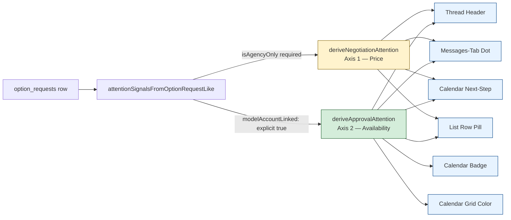

# Negotiation & Calendar Flow — Runtime QA Test Matrix (2026-04)

**Audit type:** runtime / manual QA test plan
**Companion document:** [`NEGOTIATION_CALENDAR_AUDIT_2026-04.md`](./NEGOTIATION_CALENDAR_AUDIT_2026-04.md) — static findings.
**Scope:** 8 lifecycle stages × 6 perspectives, with verification SQL per test.
**Mode:** read-only against production-like data; isolated test org recommended for stages B–E to avoid
cross-tenant noise.

**Perspectives (P1–P6):**
- **P1** Client Owner
- **P2** Client Employee
- **P3** Agency Owner
- **P4** Agency Booker
- **P5** Model with App-Account
- **P6** Model without App-Account

---

## 1. Smart Attention Pipeline (canonical reference)

The pipeline is the single source of truth for all attention signals across UI surfaces. Every test below
checks UI consistency against this pipeline.



**Consistency invariant:** if Header shows "Action required: …", then Tab-Dot is `true`, Calendar-Next-Step
matches the Header label, List-Row pill matches. Calendar-Badge/Grid follow Axis 2 only (deliberate
simplification — see `system-invariants.mdc` SMART ATTENTION & CHAT-FILTER section).

---

## 2. Lifecycle Stage A — Option / Casting creation

### Test matrix

| ID | Perspective | Scenario | Expected UI | Expected DB |
|---|---|---|---|---|
| **A1** | P1 Client Owner | Discover → Option request (model with account) | Thread visible; "Waiting for agency to confirm availability" | `status='in_negotiation'`, `final_status='option_pending'`, `model_approval='pending'`, `is_agency_only=false` |
| **A2** | P2 Client Employee | Repeat A1 | Identical to A1 — no owner gate | Identical to A1 |
| **A3** | P3 Agency Owner | Calendar → Manual create option (1 model, with account) | Created event visible in calendar; option in agency option list | `is_agency_only=true`, `final_status='option_confirmed'` (after INSERT+UPDATE), `model_approval='pending'`, `created_by_agency=true` on calendar row |
| **A4** | P3 Agency Owner | Manual create casting (3 models) | One grouped event in agency calendar; 3 individual threads | `request_type='casting'`, all 3 share `agency_event_group_id`, each has own `option_requests` row |
| **A5** | P4 Agency Booker | Repeat A3 | Identical to A3 — no owner gate | Identical to A3 |
| **A6** | P3 Agency Owner | Agency-only option for model **without account** | Auto-confirmed; no "waiting for model" anywhere | `model_approval='approved'` (auto), `model_account_linked=false`, calendar row exists |
| **A7** | P5 Model w/ Account | Receive A1 in inbox | Card visible with Accept/Decline buttons after A-step C1 (agency confirms availability) | n/a — model can only act after `final_status='option_confirmed'` |
| **A8** | P6 Model w/o Account | A6 result | No inbox entry; no `waiting_for_model` signal anywhere | `model_account_linked=false` |

### Verification SQL (apply to every A-test, substitute `<id>`)

```sql
-- Core option_requests row
SELECT id, status, final_status, model_approval, model_account_linked,
       is_agency_only, request_type, agency_event_group_id,
       client_price_status, proposed_price, agency_counter_price,
       client_organization_name, agency_organization_name
FROM option_requests WHERE id = '<id>';

-- Calendar projection
SELECT id, model_id, status, entry_type, created_by_agency,
       title, booking_details->>'kind' AS kind
FROM calendar_entries
WHERE option_request_id = '<id>'
ORDER BY created_at;

-- User calendar mirror (agency + caller)
SELECT owner_id, owner_type, status, title, color
FROM user_calendar_events
WHERE source_option_request_id = '<id>';

-- System messages — audit trail (A6 expects 'no_model_account')
SELECT kind, from_role, visible_to_model, message, created_at
FROM option_request_messages
WHERE option_request_id = '<id>' AND from_role = 'system'
ORDER BY created_at;
```

---

## 3. Lifecycle Stage B — Negotiation Axis 1 (Price)

**Invariant K reminder:** every B-step writes ONLY to Axis 1 fields (`client_price_status`, `proposed_price`,
`agency_counter_price`). `final_status` and `model_approval` MUST remain unchanged.

### Test matrix

| ID | Actor | Action | Expected DB delta |
|---|---|---|---|
| **B1** | P1/P2 Client | Propose initial fee X | `client_price_status='pending'`, `proposed_price=X`; **`final_status` unchanged** |
| **B2** | P3/P4 Agency | Make counter-offer Y | `agency_counter_price=Y`; `client_price_status` stays `pending`; **`final_status` unchanged** (Invariant K, fix 20260616) |
| **B3** | P1/P2 Client | Accept counter | `client_price_status='accepted'`; **`final_status` unchanged** |
| **B4** | P1/P2 Client | Decline counter | `client_price_status='rejected'`; RPC `client_reject_counter_offer` no `final_status` guard (Migration 20260614). UI MUST show alert if RPC returns false (R3). |
| **B5** | P3/P4 Agency | Accept client price | `client_price_status='accepted'`; **`final_status` unchanged** |
| **B6** | P3/P4 Agency | Decline client price | `client_price_status='rejected'` |

### Doppelklick test (Invariant L — inflight guard)

For each of B1–B6: rapid-click the action button 5× within 1s.
**Expected:** exactly **one** system message in `option_request_messages` (verify with SQL below).
**Failure mode:** multiple identical system messages = inflight guard missing/broken.

### B-axis verification SQL

```sql
-- Axis 1 state + axis 2 must remain stable
SELECT client_price_status, proposed_price, agency_counter_price,
       final_status, model_approval, status,
       updated_at
FROM option_requests WHERE id = '<id>';

-- System message audit (one per action expected)
SELECT kind, from_role, visible_to_model, created_at
FROM option_request_messages
WHERE option_request_id = '<id>'
  AND from_role = 'system'
  AND kind IN ('agency_counter_offer', 'agency_accepted_price', 'agency_declined_price',
               'client_accepted_counter', 'client_rejected_counter')
ORDER BY created_at;

-- B5 specifically: confirm no Axis 2 leak (final_status NOT in UPDATE payload of
-- agencyAcceptClientPriceStore — see audit R2)
SELECT final_status FROM option_requests WHERE id = '<id>';
-- Expected: same value as before B5
```

### Model data safety (Invariant D)

For each B-step, log in as **P5 Model w/ Account** and open the same thread.
**Expected:** zero price information visible. No `agency_counter_offer` system message.

```sql
-- Verify model-safe filter on system messages
SELECT kind, visible_to_model FROM option_request_messages
WHERE option_request_id = '<id>'
  AND kind IN ('agency_counter_offer', 'agency_accepted_price',
               'agency_declined_price', 'client_accepted_counter');
-- ALL rows MUST have visible_to_model = false
```

---

## 4. Lifecycle Stage C — Negotiation Axis 2 (Availability)

**Invariant K reminder:** every C-step writes ONLY to Axis 2 fields (`final_status`, `model_approval`).
`client_price_status` and price fields MUST remain unchanged.

### Test matrix

| ID | Actor | Action | Expected DB delta |
|---|---|---|---|
| **C1** | P3/P4 Agency | Confirm availability (model with account) | `final_status='option_confirmed'`; `model_approval` stays `pending`; `client_price_status` unchanged. System msg `agency_confirmed_availability` MUST be emitted (R1 risk: skipped on cache-refresh failure) |
| **C2** | P5 Model w/ Account | Accept availability via inbox | `model_approval='approved'`, `model_approved_at` set, `status='confirmed'` (when price also accepted) |
| **C3** | P5 Model w/ Account | Decline availability | `status='rejected'`; **trigger** `fn_reset_final_status_on_rejection` flips `final_status='option_pending'`; system msg `model_declined_availability` MUST be emitted (both code paths: store + ModelProfileScreen) |
| **C4** | P3/P4 Agency | Confirm availability for model **without account** | `final_status='option_confirmed'` AND `model_approval='approved'` (auto, no-account rule) |
| **C5** | P5 Model w/ Account | Try to confirm BEFORE C1 | Button hidden in inbox; `modelConfirmOptionRequest` service rejects (Invariant: agency-availability first) |

### C-axis verification SQL

```sql
-- C1: final_status flipped, model_approval stays pending
SELECT final_status, model_approval, model_approved_at, status,
       client_price_status, proposed_price, agency_counter_price
FROM option_requests WHERE id = '<id>';

-- C3 trigger chain: status='rejected' MUST reset final_status to 'option_pending'
-- Verify trigger order is intact (live-check)
SELECT trigger_name, action_timing, event_manipulation
FROM information_schema.triggers
WHERE event_object_table = 'option_requests' AND action_timing = 'BEFORE'
ORDER BY trigger_name;
-- Expected order: tr_reset_final_status_on_rejection BEFORE trg_validate_option_status

-- C3 system message
SELECT kind, message FROM option_request_messages
WHERE option_request_id = '<id>' AND kind = 'model_declined_availability';
-- Expected: exactly 1 row

-- C5 enforcement: service must reject
-- (Tested via UI / unit test, not SQL)
```

### Cross-perspective consistency check after C1

After C1, log in as **P1/P2 Client**, **P3/P4 Agency**, **P5 Model w/ Account** in three separate sessions:

| Surface | Client | Agency | Model |
|---|---|---|---|
| Thread Header | "Waiting for model to confirm availability" | "Waiting for model to confirm availability" | "Action required: confirm availability" |
| Tab Dot | true | true | true |
| Calendar Badge | yellow / "tentative" | yellow / "tentative" | yellow / "action required" |
| List Row Pill | "Waiting for model" | "Waiting for model" | "Action required" |

If any surface diverges → Invariant T regression (missing `isAgencyOnly` propagation) — see audit COVERED C5.

---

## 5. Lifecycle Stage D — Job confirmation (terminal)

### Test matrix

| ID | Actor | Action | Expected |
|---|---|---|---|
| **D1** | P1/P2 Client | Confirm job (all conditions met: price accepted + availability confirmed + model approved) | `final_status='job_confirmed'`, `status='confirmed'`, system msg `job_confirmed_by_client`, `calendar_entries.status='booked'` (via `updateCalendarEntryToJob` retry path, Invariant M) |
| **D2** | P1/P2 Client | Try confirm with `client_price_status='pending'` | Button disabled; service `client_confirm_option_job` rejects |
| **D3** | P1/P2 Client | Try confirm on agency-only request | `clientConfirmJobStore` returns `false` with `console.error` (Invariant R + agency-only rule) |
| **D4** | P3/P4 Agency | Confirm job (agency-only flow) | `final_status='job_confirmed'`, system msg `job_confirmed_by_agency` (P6 polish: not in K-table), calendar upgrade |
| **D5** | P3/P4 Agency | Calendar-upgrade-failure simulation: manually delete `calendar_entries` row before clicking confirm | First `updateCalendarEntryToJob` fails → 200ms wait → retry → if both fail, `console.error` (Invariant M) |

### D-stage verification SQL

```sql
-- D1/D4: terminal state
SELECT final_status, status, model_approval, client_price_status,
       updated_at
FROM option_requests WHERE id = '<id>';
-- Expected: final_status='job_confirmed', status='confirmed'

-- Calendar upgrade
SELECT id, status, entry_type, title
FROM calendar_entries WHERE option_request_id = '<id>';
-- Expected: status='booked', entry_type='booking', title='Job – <client_org_name>'

-- User calendar mirror
SELECT owner_id, owner_type, title, color
FROM user_calendar_events WHERE source_option_request_id = '<id>';
-- Expected: title='Job – …', color='#2E7D32' (green)

-- System message
SELECT kind FROM option_request_messages
WHERE option_request_id = '<id>'
  AND kind IN ('job_confirmed_by_client', 'job_confirmed_by_agency');
-- Expected: exactly 1 row, matching the actor (D1 = client, D4 = agency)
```

---

## 6. Lifecycle Stage E — Delete / Reject

### Test matrix

| ID | Actor | Action | Expected |
|---|---|---|---|
| **E1** | P3/P4 Agency | Remove request (before `job_confirmed`) | RPC `delete_option_request_full`: all dependent rows removed; B2B booking cards `metadata.status='deleted'` (Migration 20260820) |
| **E2** | P3/P4 Agency | Try Remove on `final_status='job_confirmed'` | RPC blocks with error message |
| **E3** | P5 Model w/ Account | Decline availability (no row delete) | `fn_cancel_calendar_on_option_rejected` sets `calendar_entries.status='cancelled'`, `user_calendar_events.status='cancelled'`, `booking_events.status='cancelled'` (Migration 20260821); B2B cards `metadata.status='rejected'` |
| **E4** | All | After E1 or E3, check calendar reads | `getCalendarForModel`, `getCalendarRange`, `getBookingEventsFor*` all hide cancelled entries |

### E-stage verification SQL

```sql
-- E1: full delete (option_requests row gone)
SELECT id FROM option_requests WHERE id = '<id>';
-- Expected: 0 rows

-- E1 cascade: dependent rows
SELECT 'calendar_entries' AS tbl, count(*) FROM calendar_entries WHERE option_request_id = '<id>'
UNION ALL
SELECT 'user_calendar_events', count(*) FROM user_calendar_events WHERE source_option_request_id = '<id>'
UNION ALL
SELECT 'booking_events', count(*) FROM booking_events WHERE option_request_id = '<id>'
UNION ALL
SELECT 'option_request_messages', count(*) FROM option_request_messages WHERE option_request_id = '<id>';
-- Expected: all zero

-- E1 B2B booking card metadata
SELECT id, metadata->>'status' AS status, metadata->>'request_type' AS request_type
FROM messages WHERE metadata->>'option_request_id' = '<id>';
-- Expected: metadata.status='deleted'

-- E3 cancellation cascade (option_requests row stays, status='rejected')
SELECT status, final_status FROM option_requests WHERE id = '<id>';
-- Expected: status='rejected', final_status='option_pending' (reset by trigger)

SELECT status FROM calendar_entries WHERE option_request_id = '<id>';
SELECT status FROM user_calendar_events WHERE source_option_request_id = '<id>';
SELECT status FROM booking_events WHERE option_request_id = '<id>';
-- Expected: all 'cancelled'

-- E3 B2B card metadata
SELECT metadata->>'status' FROM messages WHERE metadata->>'option_request_id' = '<id>';
-- Expected: 'rejected'
```

### Audit risk reminder

R4 (audit doc): `updateCalendarEntryToJob` lacks a `cancelled` filter. After E3, if the same `option_request_id`
is later upgraded (currently impossible via product flows, but possible via admin tooling), the cancelled rows
would be re-activated. Test by running E3 then a manual UPDATE to set `option_requests.status='in_negotiation'`
+ `final_status='option_confirmed'` and triggering job confirm — verify no `entry_type='booking'` appears on
cancelled rows.

---

## 7. Lifecycle Stage F — Smart Attention & Calendar consistency (cross-role)

For each of the 12 canonical lifecycle states (combination of `status` × `final_status` × `client_price_status`
× `model_approval` × `model_account_linked` × `is_agency_only`), verify that all four UI surfaces show the
**same** signal.

### State enumeration (subset, full matrix in spreadsheet)

| State | s | final | price | model | linked | aOnly | Expected attention |
|---|---|---|---|---|---|---|---|
| F1 | in_negotiation | option_pending | pending | pending | true | false | Client: "Waiting for agency"; Agency: "Action: confirm availability + price" |
| F2 | in_negotiation | option_pending | accepted | pending | true | false | Same as F1 but no price action for client |
| F3 | in_negotiation | option_confirmed | accepted | pending | true | false | Client: "Waiting for model"; Agency: "Waiting for model"; Model: "Action required" |
| F4 | in_negotiation | option_confirmed | accepted | approved | true | false | Client: "Action: confirm job"; Agency: "Waiting for client to finalize" |
| F5 | confirmed | job_confirmed | accepted | approved | true | false | All: terminal "Job confirmed" |
| F6 | rejected | option_pending | (any) | (any) | (any) | (any) | All: terminal "Rejected/Removed" — no action |
| F7 | in_negotiation | option_pending | (any) | approved | false | false | Same as F1, but Axis 2 already auto-resolved (no-account model) |
| F8 | in_negotiation | option_confirmed | accepted | approved | false | true | Agency-only: "Action: agency confirm job"; calendar badge brown |
| F9 | confirmed | job_confirmed | accepted | approved | false | true | Agency-only terminal |
| F10 | in_negotiation | option_pending | rejected | pending | true | false | Client: "Counter declined — propose new price"; price independent of availability |
| F11 | in_negotiation | option_confirmed | rejected | approved | true | false | Same as F10 but availability done; pure price impasse |
| F12 | in_negotiation | option_pending | accepted | rejected | true | false | Effectively terminal — model declined; trigger F.1 should reset (verify F6 transition) |

### Per-state UI consistency check

For each state, verify in 3 sessions (Client, Agency, Model — only model if `linked=true`):

```text
[ ] Thread Header label matches expected
[ ] Messages-Tab Dot present/absent matches Header (dot iff Header label != null)
[ ] Calendar Badge color matches expected (Axis 2 driven)
[ ] Calendar Grid color matches Calendar Badge
[ ] Calendar Next-Step text matches Header label (D1 + D2 priority)
[ ] List Row pill matches Header
```

**Failure modes:**
- Tab dot true but no Header label → eigene parallele Heuristik (Invariant T regression)
- Calendar Badge ≠ Grid → split rendering bug
- Calendar Next-Step != Header → priority drift in `calendarDetailNextStep.ts`

---

## 8. Lifecycle Stage G — Realtime / "WhatsApp speed"

| ID | Setup | Action | Expected |
|---|---|---|---|
| **G1** | Two sessions with same thread open | User A sends chat message | Appears in B's chat < 1s without refresh (`subscribeToOptionMessages`) |
| **G2** | Client has option list open; Agency confirms availability | RPC fires | Client list refreshes via `subscribeToOptionRequestChanges` within 2s; correct attention label |
| **G3** | Client has B2B chat with agency open; agency removes related request | E1 fires | OrgMessengerInline card switches to "Removed" terminal label live (UPDATE subscription, Risiko 51) |
| **G4** | Phantom-message test | Client sends chat with simulated RPC failure (e.g. revoke RLS temporarily) | Optimistic message appears then disappears (rollback via `.then(ok)` — Invariant: option-store addMessage parity with recruiting) |

### G-stage verification

```sql
-- G2: confirm option_requests row updated
SELECT updated_at, final_status FROM option_requests WHERE id = '<id>';
-- Compare timestamp before/after action

-- G3: messages.metadata.status
SELECT id, metadata->>'status', updated_at FROM messages WHERE metadata->>'option_request_id' = '<id>';
-- Expected: status flipped to 'deleted', updated_at recent
```

---

## 9. Lifecycle Stage H — Calendar deeplinks → Thread

| ID | Perspective | Action | Expected |
|---|---|---|---|
| **H1** | P1 Client | Calendar entry → Detail → "Open negotiation thread" | Switches to `messages` tab with `openThreadIdOnMessages = option_requests.id` |
| **H2** | P3 Agency | Identical via `searchOptionId` | Switches to `messages` with correct ID |
| **H3** | P5 Model w/ Account | Calendar entry → tap → `setSelectedOptionThread(id)` | Correct thread shown |
| **H4** | All | Calendar entry without `option_request_id` (orphan booking_event) | No thread jump; alert fallback (anti-name-match heuristic) |

### H-stage verification SQL

```sql
-- Confirm calendar_entries.option_request_id is set for non-orphan rows
SELECT id, option_request_id FROM calendar_entries WHERE id = '<entry_id>';
-- Expected: non-null UUID
```

---

## 10. Verification SQL Cheatsheet (production-safe, read-only)

All queries are **SELECT-only** and safe to run on production. Substitute `<id>` with the option_requests UUID.

### Core lifecycle state

```sql
SELECT id, status, final_status, model_approval, client_price_status,
       model_account_linked, is_agency_only, agency_event_group_id,
       request_type, proposed_price, agency_counter_price, currency,
       client_organization_name, agency_organization_name,
       created_at, updated_at
FROM option_requests WHERE id = '<id>';
```

### Calendar projection (all linked rows incl. cancelled)

```sql
SELECT id, model_id, status, entry_type, created_by_agency,
       title, booking_details->>'kind' AS kind, created_at
FROM calendar_entries
WHERE option_request_id = '<id>'
ORDER BY created_at;
```

### User calendar event mirror

```sql
SELECT owner_id, owner_type, status, title, color, source_option_request_id
FROM user_calendar_events WHERE source_option_request_id = '<id>';
```

### Booking events (cancelled MUST be filtered in UI reads)

```sql
SELECT id, status, scheduled_for, model_id, organization_id
FROM booking_events WHERE option_request_id = '<id>';
```

### System messages — full audit trail (per option)

```sql
SELECT kind, from_role, visible_to_model, message, created_at
FROM option_request_messages
WHERE option_request_id = '<id>' AND from_role = 'system'
ORDER BY created_at;
```

### Trigger order sanity check (anti-regression for F.1)

```sql
SELECT trigger_name, action_timing, event_manipulation, action_statement
FROM information_schema.triggers
WHERE event_object_table = 'option_requests' AND action_timing = 'BEFORE'
ORDER BY trigger_name;
-- Expected order: tr_reset_final_status_on_rejection BEFORE trg_validate_option_status
```

### SECURITY DEFINER + row_security check

```sql
SELECT proname, prosecdef, proconfig
FROM pg_proc
WHERE proname IN (
  'agency_create_option_request', 'agency_confirm_job_agency_only',
  'client_confirm_option_job', 'client_reject_counter_offer',
  'delete_option_request_full', 'insert_option_request_system_message',
  'fn_reset_final_status_on_rejection', 'fn_cancel_calendar_on_option_rejected'
)
ORDER BY proname;
-- Expected: all prosecdef=true, all proconfig include 'row_security=off' except trigger functions
```

### Active calendar rows for a model (cancelled excluded)

```sql
SELECT id, option_request_id, status, entry_type, title
FROM calendar_entries
WHERE model_id = '<model_id>' AND status != 'cancelled'
ORDER BY scheduled_for DESC NULLS LAST
LIMIT 50;
```

### B2B booking cards across an org-pair conversation

```sql
SELECT m.id, m.created_at, m.metadata->>'status' AS status,
       m.metadata->>'option_request_id' AS option_request_id,
       m.metadata->>'request_type' AS request_type
FROM messages m
WHERE m.conversation_id = '<conversation_id>'
  AND m.metadata->>'option_request_id' IS NOT NULL
ORDER BY m.created_at DESC
LIMIT 50;
```

### Cross-tenant safety check (no leaks)

```sql
-- For a given option_request, confirm it's only visible from the agency org or client org members
SELECT o.id, o.organization_id, o.client_organization_id, o.agency_organization_id
FROM option_requests o WHERE o.id = '<id>';
-- Then verify membership manually:
SELECT om.user_id, om.organization_id, p.email
FROM organization_members om
JOIN profiles p ON p.id = om.user_id
WHERE om.organization_id IN ('<client_org_id>', '<agency_org_id>');
```

---

## 11. Pass/fail summary template

Use this checklist when running the full QA pass:

```text
Stage A Creation
[ ] A1 Client Owner Discover → Option
[ ] A2 Client Employee Discover → Option
[ ] A3 Agency Owner Manual Option (model w/ account)
[ ] A4 Agency Owner Manual Casting (3 models)
[ ] A5 Agency Booker Manual Option
[ ] A6 Agency Owner Agency-only (model w/o account)
[ ] A7 Model w/ Account inbox visibility (gated by C1)
[ ] A8 Model w/o Account no inbox / no waiting signal

Stage B Axis 1 (Price) — 6 actions × inflight guard test
[ ] B1 Client propose
[ ] B2 Agency counter — verify final_status NOT touched (Invariant K)
[ ] B3 Client accept
[ ] B4 Client decline — verify alert on RPC failure (R3 area)
[ ] B5 Agency accept
[ ] B6 Agency decline
[ ] Inflight guard: 5×rapid-click → 1 system msg only

Stage C Axis 2 (Availability)
[ ] C1 Agency confirms availability — verify system msg present (R1 risk)
[ ] C2 Model accepts
[ ] C3 Model declines — verify trigger reset + system msg
[ ] C4 Agency confirms for no-account model
[ ] C5 Reverse-order enforcement (model-before-agency blocked)
[ ] Cross-perspective consistency for C1 result

Stage D Job Confirmation
[ ] D1 Client confirms job
[ ] D2 Disabled when price pending
[ ] D3 Disabled on agency-only
[ ] D4 Agency confirms agency-only job
[ ] D5 Calendar retry simulation

Stage E Delete/Reject
[ ] E1 Agency Remove (before job)
[ ] E2 Remove blocked after job
[ ] E3 Model decline cascade (calendar + booking_events cancelled)
[ ] E4 UI hides cancelled

Stage F Cross-role consistency (12 canonical states)
[ ] F1–F12 each: Header = Tab Dot = Calendar Badge = Calendar Next-Step

Stage G Realtime
[ ] G1 Chat message live
[ ] G2 Option update live
[ ] G3 B2B card metadata UPDATE live
[ ] G4 Phantom message rollback

Stage H Deeplinks
[ ] H1 Client calendar → thread
[ ] H2 Agency calendar → thread
[ ] H3 Model calendar → thread
[ ] H4 Orphan booking_event → no jump
```

---

## 12. References

- Static findings: [`NEGOTIATION_CALENDAR_AUDIT_2026-04.md`](./NEGOTIATION_CALENDAR_AUDIT_2026-04.md)
- Canonical invariants: `system-invariants.mdc`
- Trigger / chat hardening: `option-requests-chat-hardening.mdc`
- Agency-only flow: `agency-only-option-casting.mdc`
- Smart Attention pipeline: `optionRequestAttention.ts`, `negotiationAttentionLabels.ts`
