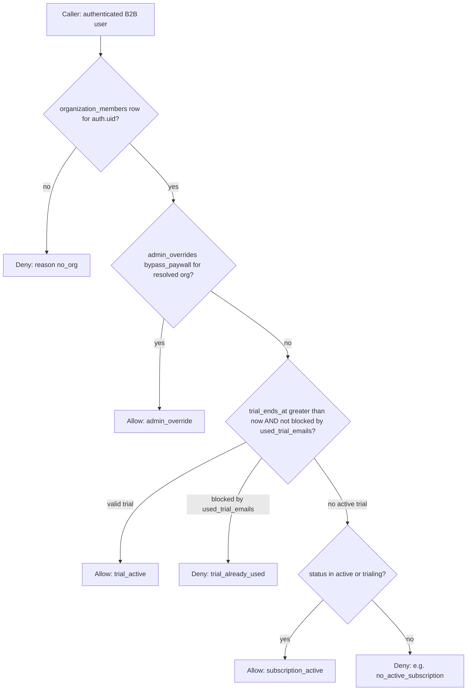

# Paywall & subscription — troubleshooting guide (support & engineering)

Operational guide for diagnosing **Agency** and **Client** B2B access issues. This is **read-only diagnosis** guidance — no frontend bypasses, no ad-hoc RLS changes.

**Authoritative rules:** [PAYWALL_SECURITY_SUMMARY.md](./PAYWALL_SECURITY_SUMMARY.md). **Manual verify matrix:** [CURSOR_PAYWALL_VERIFY.md](../CURSOR_PAYWALL_VERIFY.md). **Field-level RPC interpretation:** [PAYWALL_DEBUG_READ_ONLY.md](./PAYWALL_DEBUG_READ_ONLY.md).

---

## 1. Common support questions

### Why is organization X blocked?

Work through the decision tree (section 2). Typical causes:

- No row in `organization_members` for the user (wrong account, or not yet invited).
- Trial expired and subscription not `active` / `trialing`.
- Trial blocked by `used_trial_emails` (same email already used a trial on a **different** org).
- No `admin_overrides.bypass_paywall` when everything else failed.
- **Multi-org user:** paywall uses the **oldest** membership row only — the “blocked” org may not be the one driving `can_access_platform()`.

### Why does the Owner see Checkout but Booker / Employee does not?

**Expected behavior, not a bug.** Billing is **owner-only** (checkout session Edge Function enforces `role === 'owner'`). Org-wide **platform access** (when allowed) applies to all members for normal product features — but **starting Stripe Checkout** is reserved for the owner. Non-owners see messaging to contact the owner (see `PaywallScreen` copy).

### Why is trial not active?

Check:

- `organization_subscriptions.trial_ends_at` vs `now()` (must be in the future for trial path).
- `used_trial_emails`: if the org’s trial path is blocked because the **email hash** was already associated with another org’s trial, `can_access_platform()` returns `reason: trial_already_used`.

### Why does admin override not apply?

Confirm **all** of:

- Row exists in `admin_overrides` for the **same** `organization_id` that `can_access_platform()` resolves for this user (see oldest-membership note).
- `bypass_paywall = true`.
- Override was set via **`admin_set_bypass_paywall`** (admin path) — not a raw table edit from a client (clients cannot do this safely).

If the user has **multiple orgs**, the resolved org might not be the one you edited.

### Why does the UI show blocked while Stripe shows “paid”?

**Stripe is payment truth; the database is access truth.** Common gaps:

- Webhook delay or misconfiguration — `organization_subscriptions` not updated yet.
- Subscription status is `past_due` or `canceled` — `can_access_platform()` only treats `active` and `trialing` as subscription access (see product intent for grace periods).
- Wrong org: Stripe subscription linked to org A while the user’s **resolved** membership is org B.
- User is **Booker/Employee**: they never “see” checkout success the same way; they still inherit org access when the DB row allows it.

---

## 2. Decision tree (conceptual)

**Resolution order (fixed):** `admin_override` → `trial_active` → `subscription_active` → deny.

---

## 3. Owner-only billing vs org-wide access

| Concept | Meaning |
|--------|---------|
| **Org-wide access** | When the org passes the gate (trial, subscription, or admin override), **all** members share that access for gated product features. |
| **Owner-only** | Stripe Checkout, billing management, and other owner-exclusive org operations — **not** the same as “who can use the app when the org is unlocked.” |

Bookers and Employees use the product like owners **when access is allowed**; they simply **cannot** initiate checkout.

---

## 4. Stripe vs database vs frontend

| Layer | Role |
|-------|------|
| **Stripe** | Payment and subscription lifecycle (source for webhooks). |
| **Database** | `organization_subscriptions`, `admin_overrides`, `used_trial_emails` — what `can_access_platform()` reads. |
| **Frontend** | `SubscriptionContext` / `getMyOrgAccessStatus()` mirror RPC output for UI only — **not** an authorization boundary. |

Bypassing the paywall in the UI does **not** grant API access if RLS/RPCs still enforce.

---

## 5. Artifacts to inspect (read-only)

| Artifact | Purpose |
|----------|---------|
| `public.can_access_platform()` | JSON access decision (single RPC for client-side mirror). |
| `public.has_platform_access()` | Boolean wrapper for SQL policies / some RPCs. |
| `organization_members` | Links user to org; **oldest row** wins for paywall scope. |
| `organizations` | Org id, type (`agency` / `client`). |
| `organization_subscriptions` | Plan, status, `trial_ends_at`, periods. |
| `admin_overrides` | `bypass_paywall`, optional `custom_plan`. |
| `used_trial_emails` | Cross-org trial abuse prevention (email hash). |
| Edge `create-checkout-session` | Owner-only checkout; org from JWT. |
| Edge `stripe-webhook` | Syncs Stripe → `organization_subscriptions`. |

---

## 6. Things that are usually NOT bugs

- **Multi-org users:** deterministic **oldest** `organization_members.created_at` for `can_access_platform()` — document which org is “active” for paywall before filing a defect.
- **Models:** users with `role === model` typically have **no** `organization_members` row for agency linkage; B2B paywall RPCs are scoped to client/agency org members. Model flows are **not** the same as Client/Agency paywall guards (see security summary).
- **Non-owner cannot open Checkout:** by design.
- **RPC/network error on client:** `getMyOrgAccessStatus()` is **fail-closed** (`allowed: false`, reason often `no_org` as sentinel) — check logs, not only UI.

---

## 7. What to verify first (live / staging)

1. **After any SQL change to `can_access_platform`:** `pg_get_functiondef` on live DB — see [LIVE_DB_DRIFT_GUARDRAIL.md](./LIVE_DB_DRIFT_GUARDRAIL.md).
2. **Stripe Dashboard:** subscription id, status, customer linkage.
3. **Supabase:** rows above for the **resolved** `organization_id`.
4. **Edge logs:** `stripe-webhook` delivery success; `create-checkout-session` 403 for non-owner.

---

## 8. Read-only checklist (support / engineering)

Use in SQL editor or Management API **read-only** context. Replace placeholders safely.

1. **Who is the user?** Resolve `auth.uid()` in app; in SQL use known `user_id` UUID.
2. **Memberships:**  
   `SELECT * FROM organization_members WHERE user_id = '<user_id>' ORDER BY created_at ASC;`  
   Oldest row = org used by paywall RPC (same ordering as checkout when org not specified).
3. **Subscription row:**  
   `SELECT * FROM organization_subscriptions WHERE organization_id = '<org_id>';`
4. **Admin override:**  
   `SELECT * FROM admin_overrides WHERE organization_id = '<org_id>';`
5. **Trial email block (if trial issues):** inspect `used_trial_emails` policy-appropriate access — usually engineering-only.
6. **Call RPC as the user (app or SQL with JWT):** `select can_access_platform();` — compare JSON `allowed`, `reason`, `organization_id`.

**Do not:** edit RLS policies, insert bypass rows from non-admin paths, or “fix” access by changing frontend-only flags.

---

## 9. Escalation

- Suspected webhook or Stripe mapping bug: engineering + Stripe event id.
- Suspected wrong org resolution for multi-org: product decision (explicit org picker vs oldest-membership semantics).
- `past_due` / canceled subscription but business wants grace: product + billing policy — not automatic in current `can_access_platform` subscription branch.
